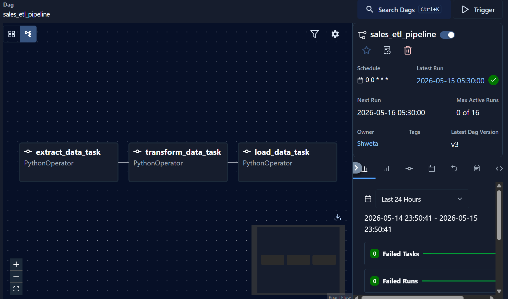
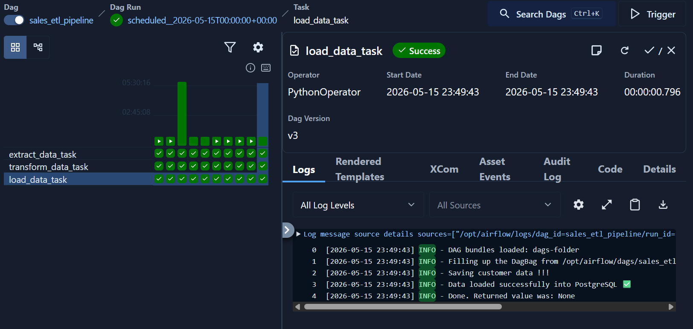
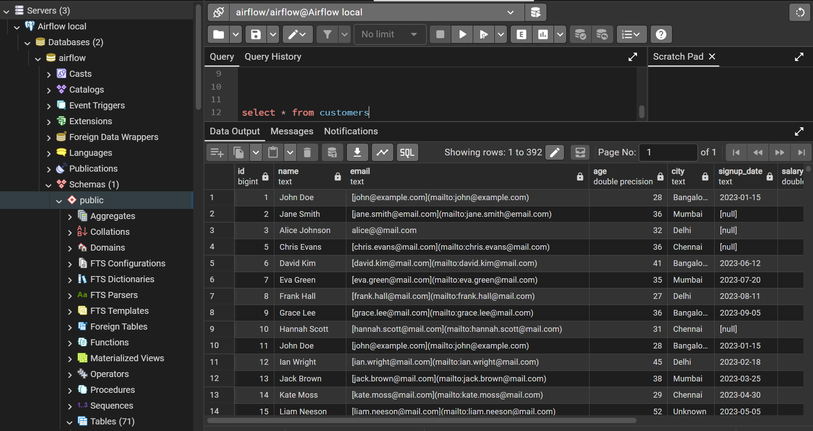
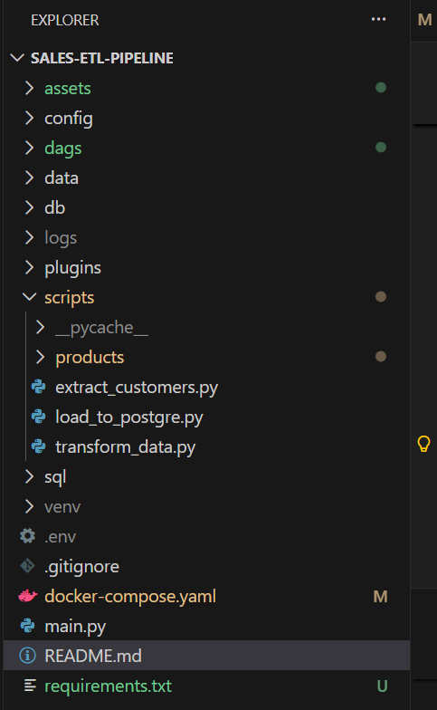

# 🚀 Sales ETL Pipeline

A production-style ETL (Extract, Transform, Load) pipeline built using Python, PostgreSQL, Docker, and Apache Airflow.

This project demonstrates two different ETL workflows:

1. **Python ETL Pipeline**
   - Extracts customer data from FakerAPI
   - Cleans and transforms the data
   - Loads data into PostgreSQL

2. **Apache Airflow ETL Pipeline**
   - Reads raw CSV customer data
   - Performs transformations
   - Loads cleaned data into Airflow PostgreSQL database using scheduled DAGs

## Stack
- Python
- Pandas
- PostgreSQL
- Apache Airflow 3.2.1
- Docker
- SQLAlchemy
- Logging

## Project Structure

```text
sales-etl-pipeline/
│
├── dags/
├── scripts/
├── data/
├── logs/
├── sql/
├── main.py
├── requirements.txt
└── docker-compose.yaml
```

## Architecture

## Flow 1 — Python ETL Pipeline
```text
FakerAPI
   ↓
Python Extraction
   ↓
Pandas Transformation
   ↓
PostgreSQL
```

## Flow 2 — Apache Airflow ETL Pipeline

```text
Raw CSV Data
↓
Python Extraction
↓
Data Cleaning & Transformation (Pandas)
↓
PostgreSQL
↓
Apache Airflow Orchestration
↓
SQL Analytics
```

## Steps
1. Extract data from REST API
2. Clean and transform using Python (pandas)
3. Load structured data into PostgreSQL
4. Schedule daily ingestion using Airflow
5. Perform analytical queries using SQL

## Key Features
- Flattened nested JSON data
- Data cleaning and validation
- Schema design and database loading
- SQL-based Analytics Queries
- Airflow DAG orchestration
- Retry handling and logging

## 1. How to Run : Python ETL Pipeline
1. Install dependencies
2. Run main.py script
3. Execute SQL queries

## 2. How to Run : Apache Airflow ETL Pipeline
## Start Airflow

```bash
docker compose up
```

## Open Airflow UI

```text
http://localhost:8080
```

## Project Screenshots



